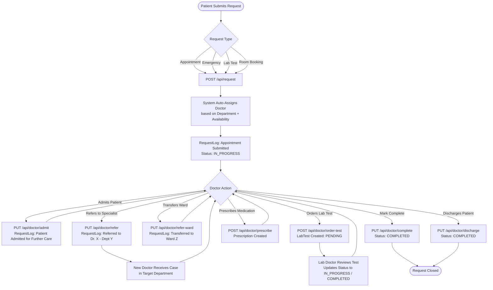
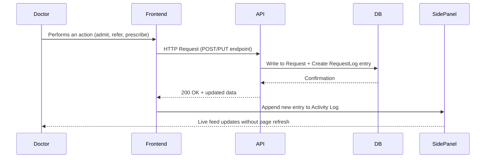
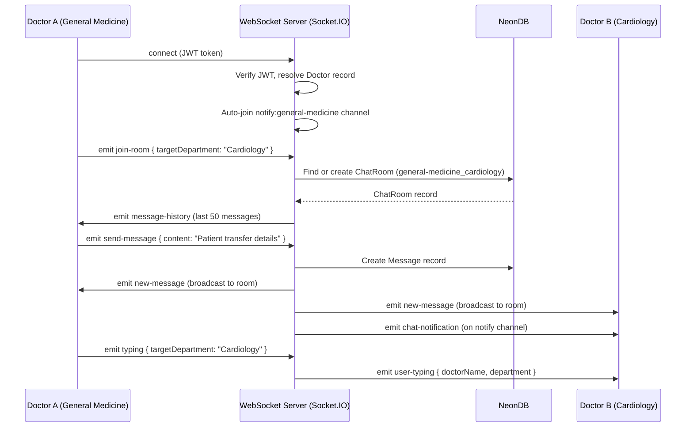
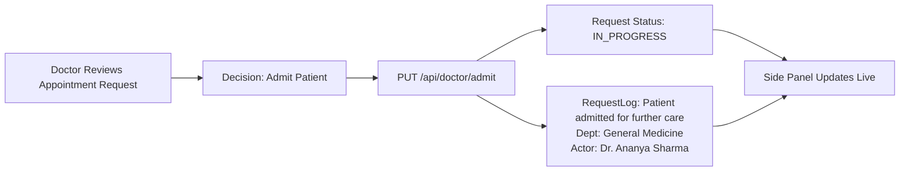
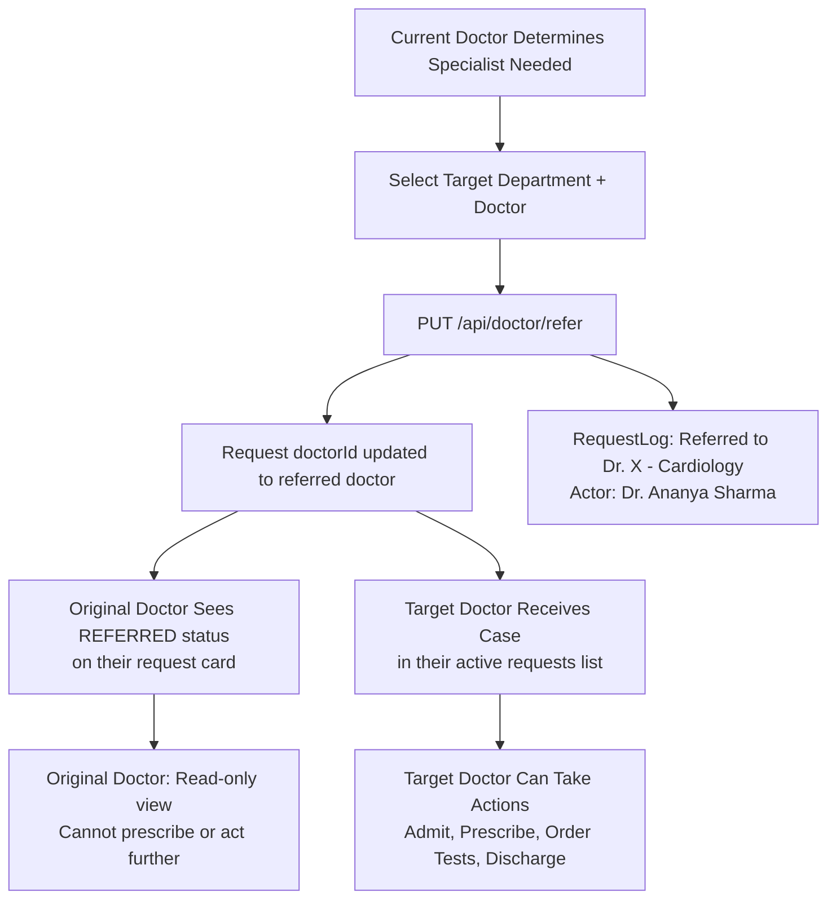
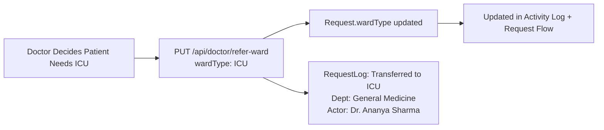
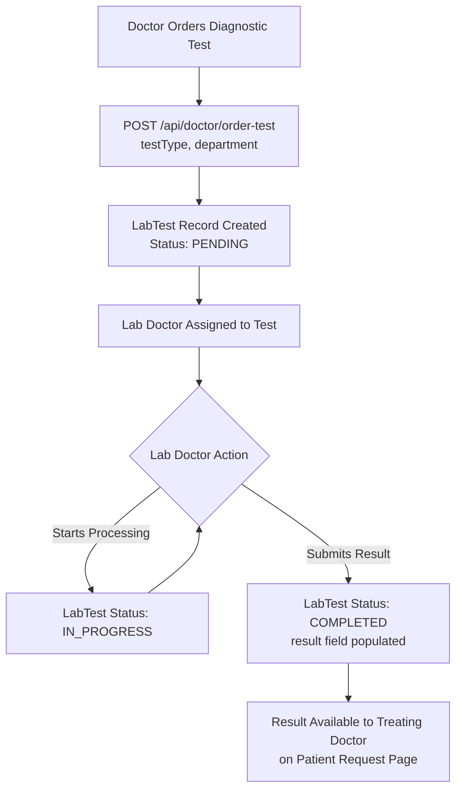
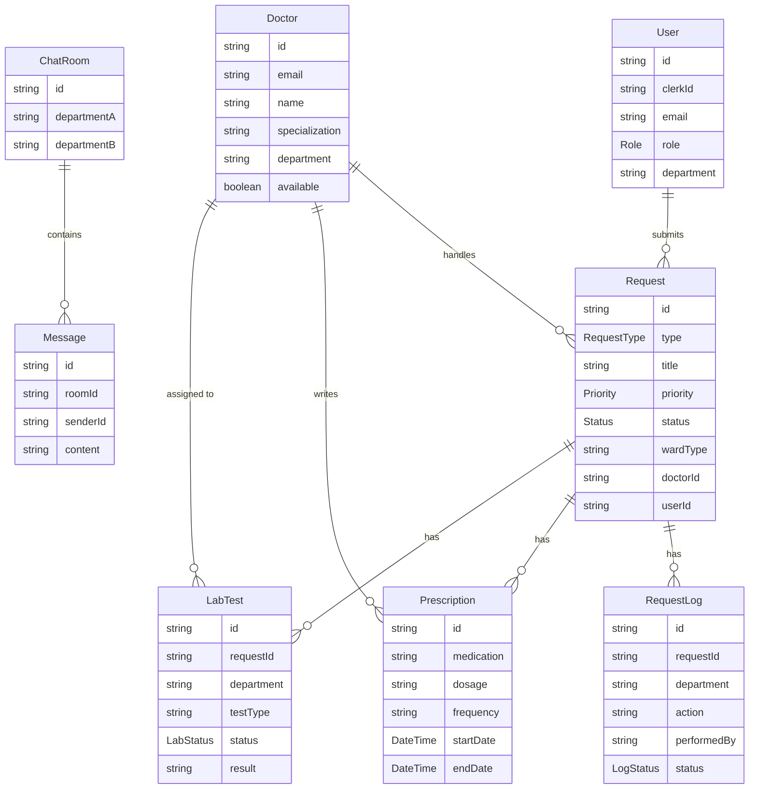
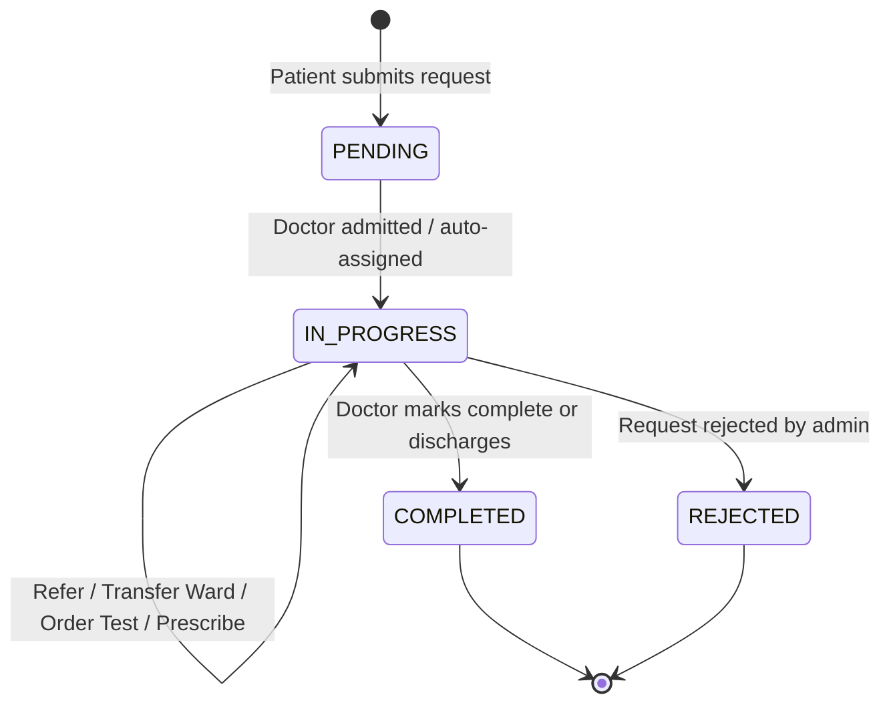

# TurboS — Hospital Inter-Department Workflow Automation System

TurboS is a full-stack hospital management platform built to digitize and streamline the end-to-end lifecycle of patient care — from the moment a patient submits a request to final discharge. It connects doctors across departments, provides real-time visibility into every action, and produces a complete, auditable history of every decision made during a patient's treatment.

---

## Table of Contents

- [Overview](#overview)
- [Core Architecture](#core-architecture)
- [Patient Request Flow](#patient-request-flow)
- [Feature: Live Activity Feed and Side Panel](#feature-live-activity-feed-and-side-panel)
- [Feature: Activity Log with Backend Tracing](#feature-activity-log-with-backend-tracing)
- [Feature: Live Inter-Department Chat](#feature-live-inter-department-chat)
- [Feature: Patient Admission](#feature-patient-admission)
- [Feature: Doctor Referral Across Departments](#feature-doctor-referral-across-departments)
- [Feature: Ward Transfer](#feature-ward-transfer)
- [Feature: Lab and Diagnostic Test Ordering](#feature-lab-and-diagnostic-test-ordering)
- [Feature: Prescription Management](#feature-prescription-management)
- [Feature: Patient Discharge](#feature-patient-discharge)
- [Feature: Emergency Requests](#feature-emergency-requests)
- [Doctor Portal](#doctor-portal)
- [Patient Dashboard](#patient-dashboard)
- [Role-Based Access Control](#role-based-access-control)
- [Database Schema Overview](#database-schema-overview)
- [Technology Stack](#technology-stack)
- [Environment Variables](#environment-variables)
- [Getting Started](#getting-started)

---

## Overview

TurboS eliminates the communication gaps between hospital departments by creating a unified, real-time platform where:

- Patients submit requests (appointments, emergencies, lab tests, room bookings)
- Doctors are auto-assigned based on department and availability
- Every action performed by any actor is logged with a timestamp, department tag, HTTP method, and status code
- Departments communicate directly via a built-in real-time chat
- A collapsible global side panel shows the full request flow and activity log on every page


---

## Core Architecture

```
┌─────────────────────────────────────────────────────────┐
│                    Next.js Frontend                      │
│  Patient Dashboard  |  Doctor Portal  |  Admin Panel     │
└────────────────────────┬────────────────────────────────┘
                         │ HTTP (REST API)
┌────────────────────────▼────────────────────────────────┐
│               Next.js API Routes (App Router)            │
│  /api/request  |  /api/doctor/*  |  /api/lab/*           │
└────────────────────────┬────────────────────────────────┘
                         │ Prisma ORM
┌────────────────────────▼────────────────────────────────┐
│              NeonDB (PostgreSQL via Prisma)               │
│  Users | Doctors | Requests | RequestLogs                │
│  LabTests | Prescriptions | ChatRooms | Messages         │
└─────────────────────────────────────────────────────────┘
                         
┌─────────────────────────────────────────────────────────┐
│        Standalone WebSocket Server (Socket.IO)           │
│  Deployed on Render / Railway                            │
│  Handles: live chat, typing indicators, notifications    │
└─────────────────────────────────────────────────────────┘
```

Authentication is handled via **Clerk** for patients / staff and a **JWT-based** custom system for doctors connecting to the WebSocket server.

---

## Patient Request Flow

The following diagram shows the full lifecycle of a patient request from submission to discharge.



---

## Feature: Live Activity Feed and Side Panel

A collapsible global side panel is available on every page of the application. It overlays the current page without blocking interaction and can be toggled open or closed at any time.

The panel has two tabs:

### Request Flow Tab

Displays a vertical timeline of every step taken on a patient's case in chronological order. Each entry in the flow shows:

- The department that performed the action (tagged badge)
- A description of the action taken
- The actor (doctor name or system)
- The exact timestamp

This view is designed to give an at-a-glance understanding of where a patient currently stands in their care journey and which departments have been involved.

```
Request Flow — Appointment: General Medicine
|
+--[GENERAL MEDICINE]  Appointment request submitted — POST /api/request 200
|   rajvish2612@gmail.com  |  Mar 2  12:28 AM
|
+--[GENERAL MEDICINE]  Auto-assigned to Dr. Ananya Sharma (available: true)
|   System  |  Mar 2  12:28 AM
|
+--[GENERAL MEDICINE]  Patient admitted for further care
|   Dr. Ananya Sharma  |  Mar 2  12:29 AM
|
+--[ICU]  Admitted to ICU
|   Dr. Ananya Sharma  |  Mar 2  12:29 AM
|
+--[CARDIOLOGY]  Referred to Dr. Alan Brooks (Cardiology)
|   Dr. Ananya Sharma  |  Mar 2  12:29 AM
```

### Activity Log Tab

Shows a reverse-chronological list of all backend API interactions associated with the current doctor or session. Each log entry displays:

- HTTP method (GET / POST / PUT) with color coding
- API endpoint that was called
- HTTP status code (200, 400, 500, etc.)
- Short human-readable description of what occurred
- The appointment context it belongs to
- The department tag
- The actor who performed the operation
- Timestamp

This is a developer-grade audit view exposed directly within the hospital UI, enabling full traceability of every backend operation.



---

## Feature: Activity Log with Backend Tracing

Every meaningful operation in the system writes a `RequestLog` record to the database. Each log entry captures:

| Field        | Description                                          |
|--------------|------------------------------------------------------|
| requestId    | The patient case this log belongs to                 |
| department   | The department performing the action                 |
| action       | Human-readable description of what was done          |
| performedBy  | Doctor name, patient email, or "System"              |
| status       | COMPLETED / IN_PROGRESS / PENDING                    |
| createdAt    | Exact timestamp of the action                        |

This forms an immutable audit trail. All logs are persisted in NeonDB (PostgreSQL) and retrieved via `/api/request/[id]` for the side panel. The activity log tab in the side panel fetches all logs across requests assigned to the current doctor, rendering them as a full chronological feed.

---

## Feature: Live Inter-Department Chat

Doctors from different departments can communicate in real time using the built-in departmental chat system. This removes the need for external messaging tools when coordinating patient care.



Key properties of the chat system:

- Each pair of departments shares a deterministic, deduplicated room ID (e.g., `cardiology_general-medicine`)
- ChatRooms are auto-created on first connection — no manual setup required
- Full message history (last 50 messages) is loaded when a doctor joins a room
- Typing indicators broadcast in real time to all members of a room
- Cross-department notifications are emitted to the target department's notification channel even if they have not joined the room
- Authentication is enforced at the WebSocket level via JWT verification middleware
- The server is deployed independently (Render / Railway) and runs on a persistent port

---

## Feature: Patient Admission

When a doctor determines that a patient requires further in-hospital care, they can formally admit the patient through the `PUT /api/doctor/admit` endpoint.

Upon admission:

- The request status is moved to `IN_PROGRESS`
- A `RequestLog` entry is created: "Patient admitted for further care"
- The doctor can optionally assign a ward type at this stage
- The admission event appears immediately in the side panel's Request Flow and Activity Log tabs



---

## Feature: Doctor Referral Across Departments

When a case requires a specialist from another department, the treating doctor can refer the patient using `PUT /api/doctor/refer`. The target doctor in the referenced department receives ownership of the case.



Referral visibility rules:

- The referring doctor retains a read-only view of the patient's request
- The referred doctor gains full action permissions on the case
- The referral is logged with both doctor names, departments, and timestamp

---

## Feature: Ward Transfer

Ward transfer allows a doctor to move a patient from one ward or unit to another (e.g., General Ward to ICU) via `PUT /api/doctor/refer-ward`.

- The ward type is updated on the Request record
- A `RequestLog` entry is created with the target ward and performing doctor
- The transfer appears in the side panel immediately



---

## Feature: Lab and Diagnostic Test Ordering

Doctors can order diagnostic investigations directly from the request management screen. The `POST /api/doctor/order-test` endpoint creates a `LabTest` record linked to the patient's request.

Supported lab departments include:

- Radiology
- Pathology
- Blood Lab
- Cardiac Lab



Lab test lifecycle states:

| Status      | Meaning                                       |
|-------------|-----------------------------------------------|
| PENDING     | Test ordered, awaiting lab doctor assignment  |
| IN_PROGRESS | Lab doctor is processing the sample           |
| COMPLETED   | Results are entered and available             |

---

## Feature: Prescription Management

Treating doctors can issue prescriptions for a patient directly linked to their active request via `POST /api/doctor/prescribe`.

Each prescription record captures:

| Field      | Description                                |
|------------|--------------------------------------------|
| medication | Name of the drug prescribed                |
| dosage     | Amount per dose (e.g., 500mg)              |
| frequency  | How often (e.g., twice daily)              |
| startDate  | When the prescription begins               |
| endDate    | When the prescription ends (optional)      |
| notes      | Additional instructions for the patient    |

Prescriptions are linked to both the doctor who issued them and the patient's active request. They are viewable from the patient dashboard under the Prescriptions section.

---

## Feature: Patient Discharge

When treatment is complete and the patient is ready to leave, the treating doctor triggers `PUT /api/doctor/discharge`.

- The request status is moved to `COMPLETED`
- A final `RequestLog` entry is created marking the discharge
- The case becomes read-only and archived in the patient's history
- The doctor's availability can be updated after discharge to accept new cases

---

## Feature: Emergency Requests

Patients or staff can create emergency requests with `RequestType: EMERGENCY`. These are treated with elevated priority (`CRITICAL` or `HIGH`) and are surfaced prominently in the doctor portal's active requests list.

Emergency requests flow through the same lifecycle as standard appointments but bypass standard scheduling and are assigned immediately to an available doctor in the relevant department.

---

## Doctor Portal

The doctor portal is a separate authenticated area of the application accessible only by registered doctors. It includes:

### Active Requests Panel
Lists all patient cases currently assigned to the logged-in doctor. Each card shows the patient name, request type, department, current status, and priority badge.

### Request Detail View
Clicking a request opens a full detail view with:
- Patient information
- All prescriptions issued so far
- All lab tests ordered and their current status
- The complete request log timeline

### Actions Available Per Request

| Action        | Endpoint                      | Effect                                              |
|---------------|-------------------------------|-----------------------------------------------------|
| Admit         | PUT /api/doctor/admit         | Admits the patient for further in-hospital care     |
| Refer         | PUT /api/doctor/refer         | Transfers case ownership to another doctor/dept     |
| Transfer Ward | PUT /api/doctor/refer-ward    | Moves patient to a different ward                   |
| Order Test    | POST /api/doctor/order-test   | Creates a new lab test for the patient              |
| Prescribe     | POST /api/doctor/prescribe    | Issues a new prescription linked to the request     |
| Complete      | PUT /api/doctor/complete      | Marks the request as resolved                       |
| Discharge     | PUT /api/doctor/discharge     | Formally discharges the patient                     |

### Chat
A dedicated chat page allows the doctor to select any department and open a real-time message thread. Unread message notifications are shown as a badge on the chat icon.

### Lab Management
Lab-affiliated doctors have a dedicated lab queue view where they can see all pending tests assigned to their department, update statuses, and enter test results.

---

## Patient Dashboard

The patient-facing dashboard is authenticated via Clerk and provides:

| Section       | Description                                              |
|---------------|----------------------------------------------------------|
| Overview      | Summary of active and past requests with status badges   |
| Appointment   | Submit a new appointment request with preferred dept     |
| Emergency     | Raise an emergency request with urgency flag             |
| Lab Test      | Request a specific diagnostic test                       |
| Prescriptions | View all prescriptions issued by assigned doctors        |
| Health Status | Overview card with current care status                   |
| Requests      | Full request history with status and timeline preview    |

---

## Role-Based Access Control

| Role  | Description                                                  |
|-------|--------------------------------------------------------------|
| USER  | Standard patient — can submit requests, view their own data  |
| STAFF | Hospital staff — department-scoped view and management       |
| ADMIN | Full access to all departments, users, and system settings   |

Doctors are managed through a separate Doctor model with their own JWT-based authentication, separate from the Clerk-based patient/staff auth flow.

---

## Database Schema Overview



---

## Technology Stack

| Layer              | Technology                        |
|--------------------|-----------------------------------|
| Framework          | Next.js 14 (App Router)           |
| Language           | TypeScript                        |
| Database           | NeonDB (PostgreSQL)               |
| ORM                | Prisma                            |
| Auth (Patients)    | Clerk                             |
| Auth (Doctors WS)  | JWT (jsonwebtoken)                |
| Real-time          | Socket.IO (standalone WS server)  |
| WS Hosting         | Render / Railway                  |
| Frontend Hosting   | Vercel                            |
| Styling            | Tailwind CSS                      |

---

## Environment Variables

### Next.js Application (`/.env`)

```
DATABASE_URL=postgresql://...
NEXT_PUBLIC_CLERK_PUBLISHABLE_KEY=...
CLERK_SECRET_KEY=...
JWT_SECRET=your_shared_jwt_secret
NEXT_PUBLIC_WS_URL=https://your-ws-server.onrender.com
```

### WebSocket Server (`/ws-server/.env`)

```
DATABASE_URL=postgresql://...
JWT_SECRET=your_shared_jwt_secret
FRONTEND_URL=https://your-app.vercel.app
PORT=3001
```

> The `JWT_SECRET` must be identical in both the Next.js app and the WebSocket server so that tokens issued by the API are accepted by the WS auth middleware.

---

## Getting Started

### Prerequisites

- Node.js 18+
- A NeonDB (or any PostgreSQL) database
- A Clerk application with publishable and secret keys

### Installation

```bash
# Clone the repository
git clone https://github.com/your-org/turbos.git
cd turbos

# Install dependencies
npm install

# Set up environment variables
cp .env.example .env
# Fill in DATABASE_URL, Clerk keys, JWT_SECRET, NEXT_PUBLIC_WS_URL

# Push the database schema
npx prisma db push

# Seed initial data (optional)
npx tsx prisma/seed.ts

# Run the development server
npm run dev
```

### Running the WebSocket Server Locally

```bash
cd ws-server
npm install
# Set DATABASE_URL, JWT_SECRET, FRONTEND_URL in ws-server/.env
npm run dev
```

The WebSocket server runs on port 3001 by default. Set `NEXT_PUBLIC_WS_URL=http://localhost:3001` in the main app's `.env` for local development.

---

## Request Status Lifecycle



---

## Priority Levels

| Priority | Use Case                                        |
|----------|-------------------------------------------------|
| LOW      | Routine check-ups, report downloads             |
| MEDIUM   | Standard appointments and lab tests (default)   |
| HIGH     | Urgent referrals and elevated concern cases     |
| CRITICAL | Emergency admissions requiring immediate action |
